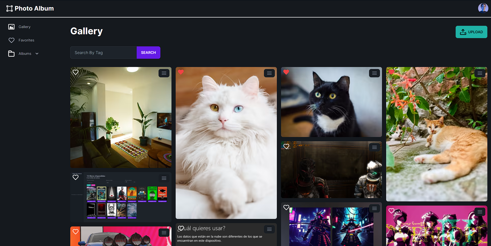
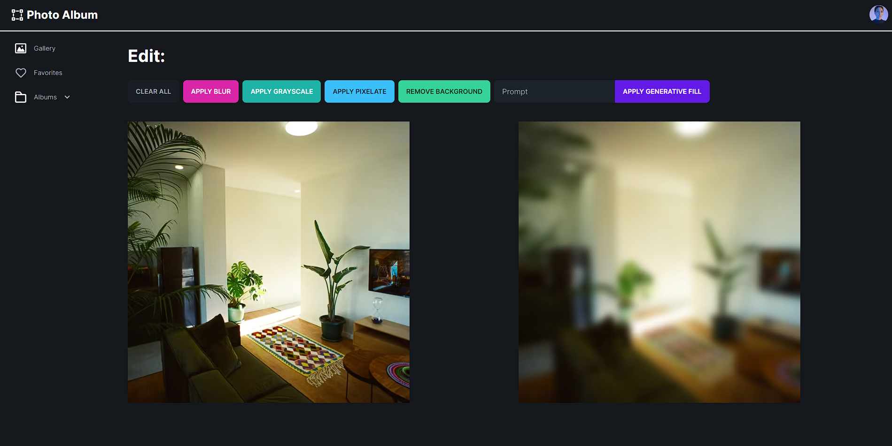

# Photo Album App



**Photo Album App** is a web application that allows you to create and browse photo galleries easily and quickly. This application is built using **Next.js**, **Tailwind CSS**, **TypeScript** and **Cloudinary** to store and manage images.

## Characteristics

- Create and customize your own photo galleries.
- Upload images to Cloudinary for secure and efficient storage.
- Browse your galleries and view photos in an attractive interface.
- Responsive and friendly interface for mobile and desktop devices.

## Used technology

- **Next.js**: React framework for modern web applications.
- **Tailwind CSS**: A utilitarian CSS framework to quickly design interfaces.
- **TypeScript**: Adds static typing to JavaScript to improve development.
- **Cloudinary**: Image storage and manipulation service in the cloud.

## Facility

1. Clone this repository to your local machine:

```bash
git clone https://github.com/jairayafranco/Photo-Album.git
```

2. Navigate to the project directory:

```bash
cd photo album
```

3. Install the dependencies using npm or yarn:

```bash
npm install
# either
yarn install
```

4. Cloudinary Configuration:
   
    - Create an account on Cloudinary if you don't already have one.
    - Get your **Cloud Name** and **Cloudinary URL** from the Cloudinary control panel.
    - Configure these credentials in the `.env.local` file:

```bash
NEXT_PUBLIC_CLOUDINARY_CLOUD_NAME=""
CLOUDINARY_URL=""
```

## Use

1. Start the development server: `npm run dev # or yarn dev`

2. Open your browser and navigate to `http://localhost:3000` to access the application.

3. Explore the different features of the app, create new galleries, upload images and enjoy your photos.
